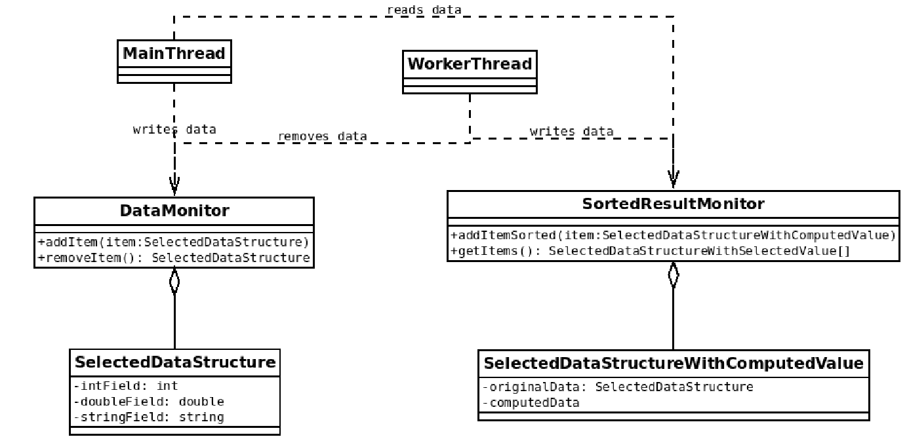

# L1. Bendra atmiuntis
## Programa a: gamintojo - vartotojo šablono takymas 
### TL;DR
Paveiksle pateikiamas apibendrintas vaidas, kaip turi veikti sukurta programa: sukuriami du monitoriai - duomenims ir reultatams. Abu monitoriai saugo masyvus, atitinkamai dar neapdorotų duomenų ir gautų reuzltatų. Pagrindinė gija skaito duomenis iš duomenų failo ir rašo į duomenų monitorių, o **lygiagrečiai** pasirinktas kiekis darbininkių gijų ima (šalina) elementus po vieną iš duomenų monitoriaus, apskaičiuoja reultatą ir jį įrašo į rezultatų monitorių. Programa turi apdoroti situacijas, kai duomenų masyvas yra tuščias ir darbininkė bando šalinti elementą bei kai duomenų masyvas yra pilnas ir pagrindinė gija nori įdėti dar vieną elementą – šiais atvejais atitinkama gija turi laukti, kol pasikeis masyvo dydis. Pagrindinės gijos tikslas — visus duomenis, perskaitytus iš failo, sudėti į riboto dydžio duomenų monitorių, palaukti, kol darbininkės baigs darbą ir rezultatus iš rezultatų monitoriaus išvesti į rezultatų failą. Darbininkių tikslas — iš duomenų monitoriaus paimti (pašalinti) įrašą, suskaičiuoti rezultatą, nuspręsti, ar jis turi patekti į rezultatus, ir jei turi, jį įrašyti į rezultatų monitorių taip, kad monitoriaus saugomas masyvas liktų surikiuotas; veiksmus kartoti, kol apdorojami visi duomenys. Programa negali turėti lenktynių sąlygų, gijų blokavimui naudojama sąlyginė sinchronizacija. **Neprivaloma laikytis diagramoje pateiktos struktūros.**



### Pilnas aprašas
Pasirinkti savo duomenų struktūrą iš 3 laukų — vienas `string`, vienas `int` ir vienas `double` tipo, operaciją (funkciją), kuri iš šios struktūros duomenų suskaičiuotų naują reikšmę bei kriterijų, pagal kurį gautos reikšmės bus išfiltruojamos. Pasirinkta funkcija turėtų būti ne triviali, kad jos apskaičiavimas užtruktų šiek tiek laiko. Paruošti tris duomenų failus, kuriuose būtų **bent po 25** pasirinktos struktūros įrašus. Duomenų failo formatas pasirenkamas laisvai. **Rekomenduojama** naudoti standartinį duomenų formatą (JSON, XML ar kt.) ir jam skaityti tinkamas priemones. Duomenų failo pavadinimas — **Grupe_PavardeV_L1_dat_x.json** (Grupe — Jūsų akademinė grupė, PavardeV — Jūsų pavardė, v., x — eilės nr., failo plėtinys — pagal pasirinktą formatą). Duomenų failai paruošiami tokie:
* **Grupe_PavardeV_L1_dat_1.json** — visi įrašai atitinka pasirinktą filtravimo kriterijų;
* **Grupe_PavardeV_L1_dat_2.json** — dalis įrašų atitinka pasirinktą filtravimo kriterijų;
* **Grupe_PavardeV_L1_dat_3.json** — nei vienas įrašas neatitinka pasirinkto filtravimo kriterijaus;

**Pagrindinė gija** atlieka tokius veiksmus duotu eiliškumu:
1. Nuskaito duomenų failą į lokalų masyvą, sąrašą ar kitą duomenų struktūrą;
2. Paleidžia pasirinktą kiekį darbininkių gijų $2 <= x <= {n \over 4}$ (n — duomenų kiekis faile).
3. Į duomenų monitorių, įrašo visus nuskaitytus duomenis po vieną. Jei monitorius yra pilnas, gija blokuojama, kol atsiras vietos.
4. Palaukia, kol visos darbininkės gijos baigs darbą.
5. Iš rezultatų monitoriaus, kuriame saugomi gauti atfiltruoti rezultatai, rezultatus išveda į tekstinį failą lentele.

**Darbininkės gijos** atlieka tokius veiksmus:
* Iš duomenų monitoriaus paima elementą. Jei duomenų monitorius yra tuščias, gija laukia, kol jame atsiras duomenų.
* Apskaičiuoja studento pasirinktą funkciją gautam elementui.
* Patikrina, ar gautas rezultatas tinka pagal pasirinktą kriterijų. Jei tinka, jis įrašomas į rezultatų monitorių taip, kad po įrašymo monitorius liktų surikiuotas.
* Darbas kartojamas tol, kol apdorojami visi iš failo nuskaityti duomenys.

**Reikalavimai monitoriams**
* Abu monitorius rekomenduojama realizuoti kaip klasę ar struktūrą, turinčią bent dvi operacijas: elementui įdėti bei pašalinti. Atliekant su Rust naudoti Rust monitorius.
* Duomenys viduje saugomi fiksuoto dydžio **masyve** (sąrašas ar kita struktūra **netinka**).
* Duomenų monitoriaus masyvo dydis neviršija pusės faile esančių elementų kiekio.
* Rezultatų monitoriaus masyvo dydis parenkamas toks, kad tilptų visi rezultatai.
* Su monitoriumi atliekamos operacijos, kur reikia, apsaugomos kritine sekcija, o gijų blokavimas realizuojamas sąlygine sinchronizacija, panaudojant pasirinktos kalbos priemones.
* Duomenų monitorius turi galėti tiek prisipildyti, tiek ištuštėti (kitaip nėra prasmės jo turėti :) ).

Rezultatų failas pavadinamas **Grupe_PavardeV_L1_rez.txt**. Failas formatuojamas lentele su antrašte, jame išvedami apskaičiuoti atfiltruoti rezultatai kartu su pradiniais duomenimis.

## Programa b: rankinis duomenų paskirstymas gijoms ir OpenMP suma
### TL;DR
Programa daro tą patį, ką ir programa a, tik naudojamos OpenMP priemonės kritinei sekcijai. Duomenų monitoriaus nereikia, vietoje to sukurti algoritmą, kaip gijoms pasidalinti iš failo nuskaitytus elementus, ir kiekviena gija apdoroja tik savo dalį. Dalys turi būti kiek įmanoma vienodo dydžio. Papildomai suskaičiuoti `int` ir `float` laukų sumas naudojant OpenMP priemones ir išvesti failo gale.

### Pilnas aprašas
Duomenų failas naudojamas tas pats, kaip programoje a, rezultatų failas toks pat su papildymu — reikia išvesti int ir float tipo laukų sumas failo pabaigoje.   
Rezultatų monitorius realizuojamas naudojantis OpenMP sinchronizacijos priemonėmis (standartinių C++ priemonių naudoti negalima, tas daroma L1a programoje).  
Programa paleidžia tokį pat kiekį gijų, kaip programoje a, bet gijos dirba tiesiogiai su duomenų masyvu ar vektoriumi (duomenų monitoriaus nebelieka). Kiekviena gija apdoroja vieną nuskaitytų duomenų vektoriaus ar masyvo dalį. Elementų padalijimą gijoms realizuoti patiems, t. y., nesinaudojant OpenMP lygiagrečiu ciklu. Elementai turi būti padalinti taip, kad su bet kokiu elementų kiekiu gijos apdorotų kiek įmanoma
labiau vienodą elementų kiekį (jei turime 27 elementus ir 6 gijas, tai 3 gijos apdoroja po 4 elementus ir 3 gijos po 5).  
Programos lygiagreti sritis skaičiuoja tą pačią funkciją ir taiko tą patį filtrą, kaip ir a programoje, su savo duomenų dalimi. Taip pat joje turi būti apskaičiuojamos ir `int` bei `float` laukų sumos naudojantis OpenMP priemonėmis. Suma randama tik tiems elementams, kurie tiko pagal filtro kriterijų. Visus skaičiavimus turi atlikti viena lygiagreti sritis.

---

## Laboratorinio darbo programos:
* C++, C#, Go, Rust — monitoriui kurti panaudojamos pasiriktos kalbos priemonės;
* C++ & OpenMP — monitoriui kurti panaudojamos OpenMP priemonės;
**L1 programų vertinimas**
* L1a — 4 taškai
* L1b — 2 taškai
* Kontrolinis — 4 taškai

---

Laboratorinio darbo atsiskaitymo savaitės: a) 5, b) 6, kontr.) 8. LD programų veikimą demonstruoti užsiėmimų laiku pagal tvarkaraštį, programų `(.cpp, .cs, .go, .rs)`, duomenų ir rezultatų failus `(.txt)` pateikti Moodle prieš atsiskaitymą.

---

## Rekomenduojamos priemonės JSON formato skaitymui
* C++ — [nlohman](https://github.com/nlohmann/json)
* C# — [DataContactJsonSerializer](https://docs.microsoft.com/en-us/dotnet/framework/wcf/feature-details/how-to-serialize-and-deserialize-json-data)
* Go — [Unmarshal](https://blog.golang.org/json-and-go)
* Rust - [serde_json](https://docs.serde.rs/serde_json/)

## Duomenų ir rezultatų failų pavyzdžiai
Duoemnų faile pateikiami studentų duomenys. **Pastaba**: faile turėtų būti daugiau duomenų; studentai turėtų sugalvoti savo duomenų struktūrą.
```json
{
    "students": [
        {"name": "Antanas", "year": 1, "grade": 6.95},
        {"name": "Kazys", "year": 2, "grade": 8.65},
        {"name": "Petras", "year": 2, "grade": 7.01},
        {"name": "Sonata", "year": 3, "grade": 9.13},
        {"name": "Jonas", "year": 1, "grade": 6.95},
        {"name": "Martynas", "year": 3, "grade": 9.13},
        {"name": "Artūras", "year": 2, "grade": 7.01},
        {"name": "Vacys", "year": 2, "grade": 8.65},
        {"name": "Robertas", "year": 3, "grade": 6.43},
        {"name": "Mykolas", "year": 1, "grade": 6.95},
        {"name": "Aldona", "year": 3, "grade": 9.13},
        {"name": "Asta", "year": 2, "grade": 7.01},
        {"name": "Viktoras", "year": 2, "grade": 8.65},
        {"name": "Artūras", "year": 5, "grade": 8.32},
        {"name": "Vytas", "year": 3, "grade": 7.85},
        {"name": "Jonas", "year": 1, "grade": 6.95},
        {"name": "Zigmas", "year": 3, "grade": 9.13},
        {"name": "Artūras", "year": 2, "grade": 7.01},
        {"name": "Simas", "year": 3, "grade": 6.43}
    ]
}
```

Duotiems duomenims buvo pritaikyta operacija — vardas, metai ir pažymys apjungti į vieną tekstinę eilutę, ir gautam rezultatui apskaičiuota *SHA1* maišos funkcija. Faile išvedami tik tie rezultatai, kurie prasideda raide, ne skaitmeniu. Rezultatai surikiuoti pagal abėcėlę.
```
            Name|       Year|         Grade|                                              Hash
----------------------------------------------------------------------------------------------
           Jonas|          1|          6,95|          A18EAC8F30AC0FC630AE175A851CA5DA24FA8C85
           Jonas|          1|          6,95|          A18EAC8F30AC0FC630AE175A851CA5DA24FA8C85
         Antanas|          1|          6,95|          C4DE32954C067D224E22D55EB51F3774C3514B53
            Asta|          2|          7,01|          DC9556314AD1156B6E0CDBCB0927213B3316298D
           Kazys|          2|          8,65|          E763185F4B7303A787ACC513B7AA56706C7A42AC
          Aldona|          3|          9,13|          F1276E77671506983D8AE579D5BCC497F2F61346
         Mykolas|          1|          6,95|          FCBAB847E2FA87F8D54B77ED416B274D8677C61A
```

## OpenMP projektų kūrimas
### Windows + Visual Studio
1. Atidaryti `Project` -> `Properties`.
2. Išskleisti `Configuration Properties`.
3. Išskleisti `C/C++`.
4. Pasirinkti `Language`.
5. Įjungti parinktį `OpenMP Support`.

### CMake
`CMakeLists.txt` faile pridėti komandą `set(CMAKE_CXX_FLAGS "${CMAKE_CXX_FLAGS} -std=c++17 -fopenmp")`

### Ubuntu + g++
Kompiliuojant nurodyti `-fopenmp` parametrą, pvz., `g++ -c test.cpp -o test.o -fopenmp`.

## Rust aplinkos konfigūravimas
1. Atsisiųsti RustUp iš [https://rustup.rs/](https://rustup.rs/).
2. Pasileisti atsisiųstą failą, pasirinkti numatytąsias parinktis. Įrankis sukonfigūruos kompiliatorių.
3. Pasileisti GoLand aplinką, pasirinkti Plugins, paieškoje surasti Rust papildinį ir įsidiegti. Kartu su juo bus įdiegtas ir ToML papildinys.
4. Paleidus GoLand iš naujo galima rinktis `New Project`, pasirinkti Rust. Projekto kūrimo metu, jei tai dar nepadaryta, aplinka pasiūlys atsisiųsti standartinę Rust biblioteką, rekomenduojama tą padaryti.
5. Jei reikalingos derinimo priemonės, galima bandyti pasileisti derintuvę, tada aplinka pasiūlys įsidiegti Native Debugging papildinį — tą padarius bus galima naudoti visas GoLand derinimo priemones.