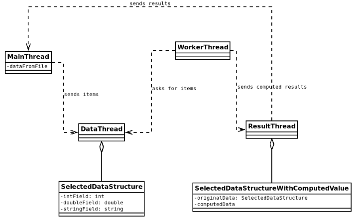

# L2. Paskirstyta atmintis
## Užduotis
Modifikuoti L1a programą taip, kad **nebeliktų bendros atminties**, o komunikacija tarp gijų vyktų apsikeičiant žinutėmis vietoj monitorių metodų kvietimų.

Duomenų failai naudojami tie patys, kaip L1 darbo metu; rezultatų failams keliami tie patys reikalavimai, kaip L1 darbo metu.

Paveiksle pateikiamas apibendrintas vaizdas, kaip turi veikti sukurta programa: sukuriami 4 roles atliekantys procesai: vienas pagrindinis (galima panaudoti pagrindinę giją), vienas duomenų valdymo, vienas rezultatų valdymo ir keletas darbininkų. Pagrindinis procesas bei darbininkai siunčia žinutes duomenų procesui su užklausomis įdėti arba pašalinti elementą iš masyvo, kurį viduje turi duomenų procesas. Darbininkai, gavę elementą, skaičiuoja pasirinktos funkcijos rezultatą ir jei jis tenkina pasirinktą sąlygą, siunčia rezultatų procesui, kuris gautus rikiuotus rezultatus saugo savo masyve. Apdorojus visus elementus rezultatų procesas pagrindiniam persiunčia visus gautus rezultatus. Duomenų procesas gali tik priimti žinutes-instrukcijas, kaip modifikuoti saugomą masyvą, rezultatų procesas papildomai darbo pabaigoje dar persiunčia rezultatus pagrindiniam procesui. Diagramoje rodoma, kokiomis kryptimis turi būti siunčiamos žinutės tarp procesų.

**Pagrindinis procesas** atlieka tokius veiksmus duotu eiliškumu:
1. Nuskaito duomenų failą į laisvai pasirinktą duomenų struktūrą;
2. Paleidžia procesus:
    * pasirinktą kiekį darbinių procesų $2 \leq x \leq \frac{n}{4}$ (n - duomenų kiekis faile), kurie ims įrašus, vykdys su jais pasirinktą operaciją ir, jei rezultatas atitinka pasirinktą kriterijų, įrašys į rezultatų struktūrą;
    * vieną duomenų masyvą valdantį procesą;
    * vieną rezultatų masyvą valdantį procesą.
3. Duomenų masyvą valdančiam procesui po vieną persiunčia visus nuskaitytus elementus iš failo.
4. Iš rezultatų masyvą valdančio proceso gauna rezultatus.
5. Gautus rezultatus išveda į tekstinį failą lentele.

**Darbiniai procesai** atlieka tokius veiksmus:
1. Iš duomenų masyvą valdančio proceso paprašo įrašo ir jį gauna;
2. Apskaičiuoja pasirinktos operacijos rezultatą;
3. Jei gautas rezultatas tenkina pasirinkt1 kriterijų, siunčia jį rezultatų masyvą valdančiam procesui;
4. Darbas kartojamas, kol bus apdoroti visi įrašai.

**Duomenų masyvą valdančiam procesui** keliami tokie reikalavimai:
1. Turi **tik sau** matomą masyvą, kurio dydis neviršija pusės duomenų faile esančio duomenų kiekio;
2. Iš kitų procesų gali gauti žinutes, kad reikia įdėti ar pašalinti įtašus ir tuos veiksmus atlikti;
3. Iš kitų procesų gali gauti žinutes, kad reikia įdėti ar pašalinti įrašus ir tuos veiksmus atlikti;
4. Jei duomenų masyvas yra pilnas, turi **nepriimti žinučių** iš įterpiančio proceso;
5. Jei duomenų masyvas yra tuščias, turi **nepriimti žinučių** iš šalinančių procesų.

**Rezultatų masyvą valdančiam procesui** keliami tokie reikalavimai:
1. Turi **tik sau** matomą pakankamo dydžio masyvą, kuriame dedami gauti įrašai;
2. Turi galėti įterpti elementą, gautą iš kito proceso, bei persiųsti esamus elementus pagrindiniam procesui;

Procesų darbui keliami tokie reikalavimai:
* Kai apdoroti visi duomenys, procesai patys baigia darbą;
* Duoemys procesams perduodami naudojant kanalus (Go) arba žinutes (MPI).
* Pagrindiniame procese saugomas duomenų masyvas turi galėti tiek pasipildytim tiek ištuštėti (jei tai sukurtoje programoje nevyksta, turi būti įmanoma tai padaryti pridėjus `sleep` kreipinių).

---

## Laboratorinio darbo priemonės
pasirinkti vieną:
* Go (visai sinchronizacijai naudojami kanalai);
* C++ ir MPI (naudojami MPI procesai bei komunikatorius).

## L2 programų vertinimas
* L2a - 6 taškai
* Kontrolinis - 4 taškai

---

Laboratorinio darbo atsiskaitymo savaitės:
a) 10,
kontr.) 12.
LD programų veikimą demonstruoti užsiemimų laiku pagal tvarkaraštį, programų (.go, .cpp), duomenų ir rezultatų failis (.txt) pateikti Moodle prieš atsiskaitymą.

---

## MPI diegimas asmeniniame kompiuteryje
MPI veikia tik Linux aplinkoje.  
**Pastaba**: Kontrolinio metu bus galima naudoti tik universiteto serverį.  
**Norintiems naudotis universiteto serveriu:**  
1. Laboratorinių darbų metu dėstytojo paprašyti prisijungimo prie serverio duomenų;
2. Su gautais duomenimis naudojant SSH jungtis į serverį `mpilab.elen.ktu.lt`.
**Turintiems Debian pagrindo Linux sistemą (Ubuntu ir kt.)**:  
1. Įdiegti g++ kompiliatorių: `sudo apt install g++`
2. Įdiegti MPI biblioteką: `sudo apt install libopenmpi-dev openmpi-bin`
**Turintiems Windows 10 kompiuterį**:
1. Įgalinti "Windows Subsystem for Linux": PowerShell įvykdyti komandą: `Enable-WindowsOptionalFeature -Online -FeatureName Microsoft-Windows-Subsystem-Linux`
2. Iš naujo paleisti kompiuterį;
3. "Microsoft Store" surasti ir atsisiųsti "Ubuntu 18.04 LTS";
4. Paleisti įdiegta "Ubuntu" programėlę;
5. Atsidariusioje komandinėje eilutėje susikurti naudotojo vardą ir slaptažodį;
6. Įvykdyti žingsnius iš aukščiau pateiktos Linux instrukcijos;
7. Iš Linux terminalo Windows sistemos failai turėtų būti pasiekiami iš `/mnt` direktorijos. 